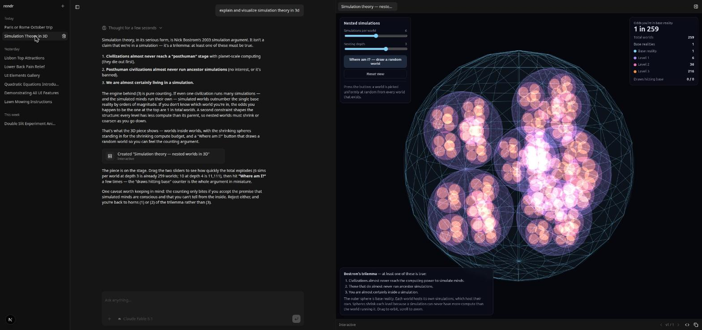

# rendr

**Ask anything. The answer takes whatever shape fits it best.**

rendr is a chat assistant whose defining feature is the *interface*. Instead
of a wall of text, the agent chooses the best **form** for each reply — prose,
a comparison table, a chart, a diagram, an interactive simulation, or a
document that lives beside the conversation and gets iterated on. It is a
working demonstration of the current state of **generative UI**: an LLM that
streams user interface, not just words, with the guardrails that make that
safe to ship.



> Try: *"Paris or Rome for three days in October?"* → a side-by-side
> comparison. *"Teach me about simulation theory"* → prose with a structured
> breakdown. *"Visualize it in 3D"* → a three.js piece with sliders, built on
> the fly and pinned to the stage. *"Plan my week"* → a document you both edit.

## What it demonstrates

Generative UI comes in tiers, and rendr has all four, each with its own
mechanism and safety boundary:

| Channel | What it is | How it works | Boundary |
| --- | --- | --- | --- |
| **Prose** | Markdown, code, math, mermaid diagrams | [Streamdown](https://streamdown.ai) renders the stream as it arrives | always on |
| **Inline UI** | Structured components inside a reply: comparisons, key facts, steps, timelines, charts, itineraries, pros/cons, image grids, questions with choices, small forms | [json-render](https://github.com/vercel-labs/json-render): the model streams a JSON spec against a **typed catalog** (`lib/ui/catalog.ts`, Zod-defined shadcn primitives + composites); the client renders it progressively. Forms and Choices answer back through a `reply` action | constrained vocabulary — the model can only compose what the catalog allows |
| **Pieces** | Freeform agent-authored HTML: animations, interactives, simulations, 3D scenes, mini-apps | An [MCP Apps](https://modelcontextprotocol.io) host. The piece runs on a **second origin** behind a strict CSP; the only libraries available are a pinned, load-tested CDN manifest (`lib/pieces/manifest.ts` — three, d3, p5, Chart.js, Plotly, Leaflet, matter-js, Tone.js, …). A small `rendr` API lets the piece talk back (`rendr.send()`, `rendr.setContext()`) so the agent knows what the user did | sandboxed origin + CSP + library allow-list |
| **Artifacts** | Persistent, versioned things: `html` pieces, `mermaid` diagrams, `markdown` documents | The **stage**: a pane of tabs beside the chat. The agent creates and edits through tools (`createArtifact`, `editArtifact`, `rewriteArtifact`, `readArtifact`); the user can edit directly; every change is a version | shared workspace with history |

The choice of form is the model's, guided by a prompt rubric
(`lib/ai/prompts.ts`) that is deliberately restrained: most replies are prose;
structure when the content has structure; a piece only when *seeing it move*
teaches more than a picture; the stage only for things worth keeping open.

Other things worth showing:

- **Research via MCP.** Any MCP server's tools are available to the agent
  (`rendr.mcp.json`). Out of the box: DuckDuckGo search + page fetch, no keys.
  Consecutive lookups collapse into one "Looked up …" line; found images go
  into an `Images` piece with captions and source links.
- **Replies survive navigation.** Generation runs to completion server-side;
  leaving and returning to a chat reconnects to the live stream.
- **Three model backends behind one picker.** Claude on a Claude subscription
  (through the Claude Agent SDK), GPT on a ChatGPT subscription (through the
  Codex CLI) — neither needs an API key — or anything on OpenRouter. The same
  prompt, tools and renderers on all three.
- **Attachments.** Images, PDFs and text files go to the model.

## Demo script

A ten-minute walk-through that hits every channel, in order of increasing
ambition. Each prompt is a fresh message in the same chat.

1. **Prose** — *"What's the difference between a Roth and a traditional IRA?"*
   Plain markdown. Point out that most answers stay prose on purpose.
2. **Inline UI** — *"Compare them side by side for someone earning $120k."*
   A `Compare` composite streams in. Expand it, pin it to the stage.
3. **Asking back** — *"Help me pick a laptop."* The model asks with `Choices`
   instead of guessing; click one and the answer comes back as a message.
4. **Research** — *"What's the weather like in Lisbon in November, with photos?"*
   Watch the research trail collapse; images land in an `Images` grid.
5. **Diagram** — *"Show me how OAuth's authorization-code flow works."*
   Inline mermaid; then *"Put that on the stage so we can refine it"* → a
   mermaid artifact with version history.
6. **Piece** — *"Show me how a double pendulum becomes chaotic — let me nudge
   the starting angle."* A sandboxed simulation with a slider. Drag it, then
   ask *"What did I just do?"* — the piece reported its state via
   `rendr.setContext()`.
7. **Document** — *"Draft a one-page brief on what we just covered."* A
   markdown artifact. Edit a line yourself, then ask the model to expand a
   section: it reads your edit first.
8. **Navigation** — start a long reply, click another chat, come back. It's
   still streaming.

## Architecture

```
browser ──► /api/chat ──► backend ──► UI message chunk stream ──► json-render transform ──► client
                          │                                        (lifts ```spec JSON into data parts)
                          ├─ Claude Agent SDK  (Claude models, subscription-billed)
                          ├─ Codex CLI         (GPT models, subscription-billed)
                          └─ AI SDK ToolLoopAgent + OpenRouter  (everything else)
```

- **One stream format.** Every backend produces the AI SDK's UI message chunks
  (`text-delta`, `reasoning-delta`, `tool-input-*`, `tool-output-*`). The
  Claude Agent SDK backend (`lib/ai/claude/stream.ts`) translates the SDK's
  Messages-API events into them, exposes rendr's tools to the SDK as an
  in-process MCP server, and passes research servers straight through. The
  Codex backend (`lib/ai/codex/stream.ts`) does the same for the CLI's JSONL
  thread events; since Codex only reaches MCP servers over a command or a URL,
  the tools are served back to it for the length of one turn from
  `/api/mcp/rendr/[token]` (`lib/ai/codex/tool-bridge.ts`), which executes them
  in this process — so the UI still gets the full artifact snapshot. Codex
  gates MCP calls behind approval and nobody is at a terminal to give it, so
  rendr's servers are pre-approved in the thread's config.
- **Inline UI is a transform, not a tool.** The model writes a ```` ```spec ````
  fence of JSONL patches inside its prose; `pipeJsonRender` lifts it out of the
  text stream into `data-spec` parts that the client assembles into a spec and
  renders progressively. A repair stage in front of it fixes mis-bracketed
  lines the model occasionally produces on long single-line patches.
- **Pieces are MCP Apps.** The stage hosts each piece in an iframe on a second
  origin (`public/sandbox.html`, proxied), with `public/piece-runtime.js`
  injected to provide the `rendr` bridge over the MCP Apps `AppBridge`.
- **Prompt caching.** On the Claude backend each chat is one SDK session that
  later turns *resume* rather than replay, so the cached prefix is identical
  turn to turn; the system prompt is static and recorded once per session;
  per-turn context (piece state) rides in the user message.
- **Live streams.** `lib/ai/live-streams.ts` tees every reply into an
  in-memory registry; `GET /api/chat/[id]/stream` replays and follows it
  (`useChat({ resume: true })`), `DELETE` stops it.

## Models

Three backends behind one model picker (`lib/ai/models.ts`):

- **Claude, on your subscription** — `claude-opus-5` (default),
  `claude-fable-5-1`, `claude-sonnet-5` run through the
  [Claude Agent SDK](https://code.claude.com/docs/en/agent-sdk/overview) under
  the Claude Code login on the machine (`claude` → `/login`; Pro/Max plans
  cover SDK usage). No API key; usage draws from the plan's limits.
- **GPT, on your ChatGPT subscription** — `gpt-6-astra`, `gpt-5.6-sol`,
  `gpt-5.6-terra`, `gpt-5.6-luna` run through the
  [Codex SDK](https://www.npmjs.com/package/@openai/codex-sdk), which drives
  the `codex` CLI bundled with the app (`pnpm exec codex login`; Plus/Pro plans
  cover it). No API key; usage draws from the plan's limits.
  `pnpm exec codex debug models` lists what the login can run — that catalog is
  where these ids come from.
- **OpenRouter** — Claude via API billing, DeepSeek, Kimi, GPT, Grok — through
  the AI SDK `ToolLoopAgent`. Needs `OPENROUTER_API_KEY`. Model ids must exist
  on `https://openrouter.ai/api/v1/models`.

## Research (MCP)

`rendr.mcp.json` lists the servers. With no keys it runs DuckDuckGo search +
page fetch via `uvx` (so Python's [`uv`](https://docs.astral.sh/uv/) must be
installed). Set `BRAVE_API_KEY` or `TAVILY_API_KEY` and the keyed provider
replaces DuckDuckGo automatically. Add any other stdio or HTTP server the same
way — Firecrawl, Exa, a database, your own.

## Running

Requires Node 22+, pnpm, and (for the default research servers) `uv`.

```sh
cp .env.example .env.local   # OPENROUTER_API_KEY for the pay-per-token models
pnpm install
pnpm db:migrate
pnpm dev                     # http://localhost:3000
```

The subscription backends each need one login on the same machine, and neither
needs an API key:

```sh
claude                       # then /login — for the Claude models
pnpm exec codex login        # ChatGPT sign-in — for the GPT models
```

No accounts in the app itself: a guest cookie scopes chats per browser;
attachments live under `data/uploads`, the SQLite database under `data/`, and
each backend's resumable sessions under `data/claude-sessions` and
`data/codex-threads`.

Pieces need a second origin for their sandbox. In development the app is at
`localhost:3000` and the sandbox at `127.0.0.1:3000` automatically; in
production set `NEXT_PUBLIC_SANDBOX_ORIGIN` (and `RENDR_HOST_ORIGINS` for the
`frame-ancestors` CSP).

## Stack

Next.js 16 · React 19 · Tailwind 4 · shadcn (Radix) · AI Elements · AI SDK 7 ·
Claude Agent SDK · Codex SDK · OpenRouter · json-render · MCP Apps · Streamdown · drizzle +
libsql (SQLite) · Biome.

## Layout

```
app/api/chat/route.ts        request handler: picks the backend, persists messages
app/api/chat/[id]/stream/    resume (GET) and stop (DELETE) a reply in flight
lib/ai/agent.ts              ToolLoopAgent factory for the OpenRouter backend
lib/ai/claude/               Claude Agent SDK backend: stream bridge + title generation
lib/ai/codex/                Codex CLI backend: stream bridge, tool bridge, title generation
app/api/mcp/rendr/[token]/   the presentation tools, served to the Codex CLI over MCP
lib/ai/live-streams.ts       in-memory registry of in-flight replies
lib/ai/prompts.ts            identity + form-selection rubric, assembled per channel
lib/ai/models.ts             model list and backends
lib/ai/tools/artifacts.ts    createArtifact / editArtifact / rewriteArtifact / readArtifact / listArtifacts
lib/ui/catalog.ts            inline-UI vocabulary (Zod); lib/ui/registry.tsx renders it
lib/ui/spec-repair.ts        repairs mis-bracketed spec lines before json-render sees them
lib/mcp/                     MCP client registry: rendr.mcp.json → agent tools (OpenRouter path)
lib/pieces/manifest.ts       pinned CDN library menu for pieces (also feeds the sandbox CSP)
lib/pieces/host.ts           MCP Apps host (AppBridge over the sandbox proxy)
public/sandbox.{html,js}     the sandbox proxy page (second origin)
public/piece-runtime.js      injected into every piece: bridge + `rendr` API
lib/artifacts/               kinds + server store (versions)
lib/db/                      drizzle schema, queries, migrations
stores/artifacts.ts          client store for the stage (artifacts, drafts, active tab)
components/chat/             chat shell, message part renderers, artifact cards, model picker,
                             history sidebar, research trail, attachments
components/stage/            the stage pane, per-kind views, message-stream sync
components/ai-elements/      AI Elements (shadcn-style, re-addable via the CLI)
```

## Conventions

- Each presentation channel owns a prompt section in `lib/ai/prompts.ts`, its
  tools in `lib/ai/tools/`, and a part renderer in
  `components/chat/message-parts.tsx`.
- AI Elements and shadcn primitives are re-added via their CLIs rather than
  hand-edited.
- `pnpm lint` / `pnpm format` (Biome).
- There is no eval harness by design: form choices are judged by looking at
  them, and the prompt and catalog are iterated on by hand.

## License

Apache-2.0
